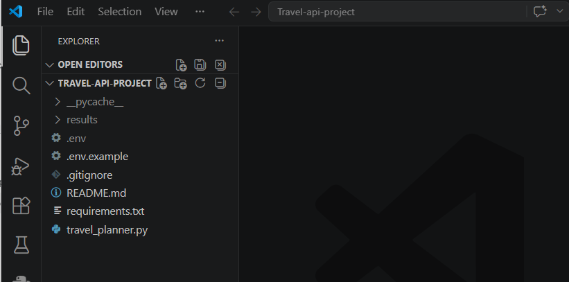
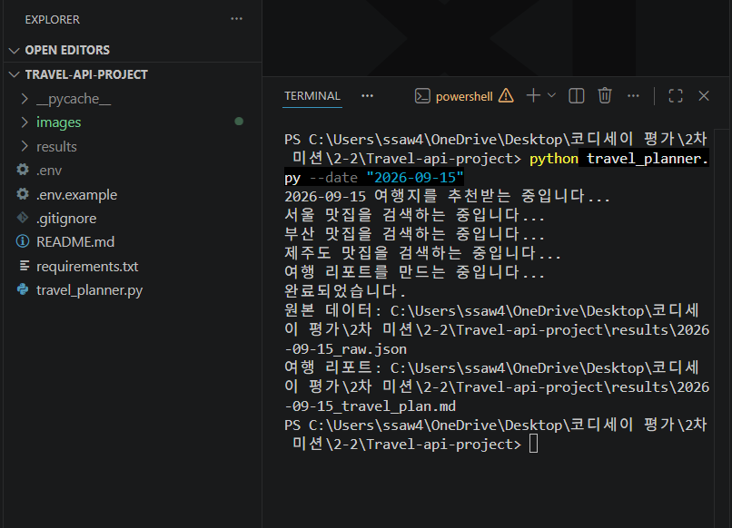
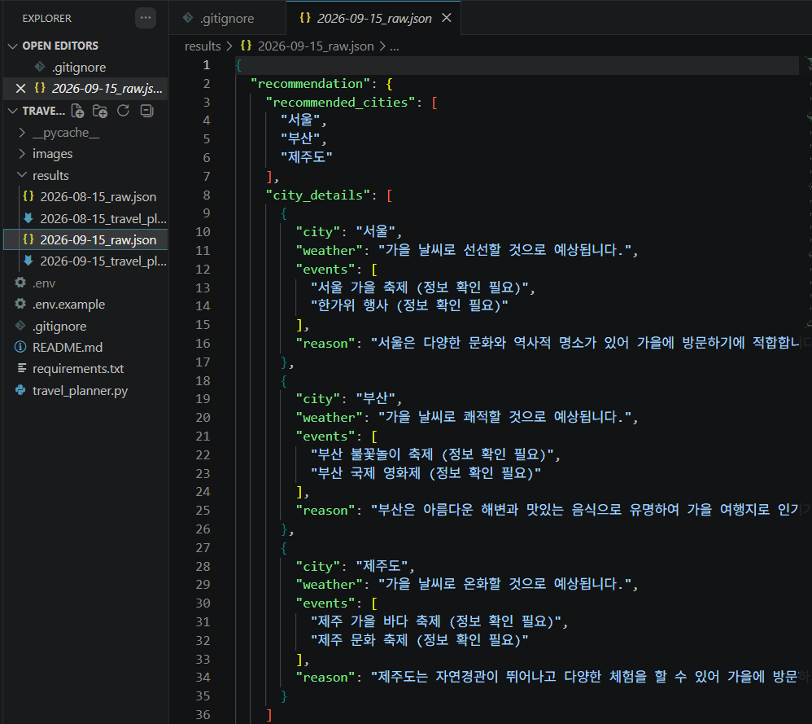
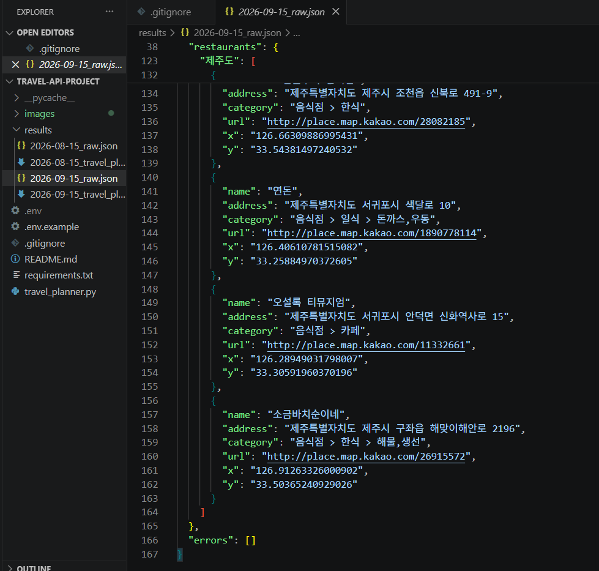
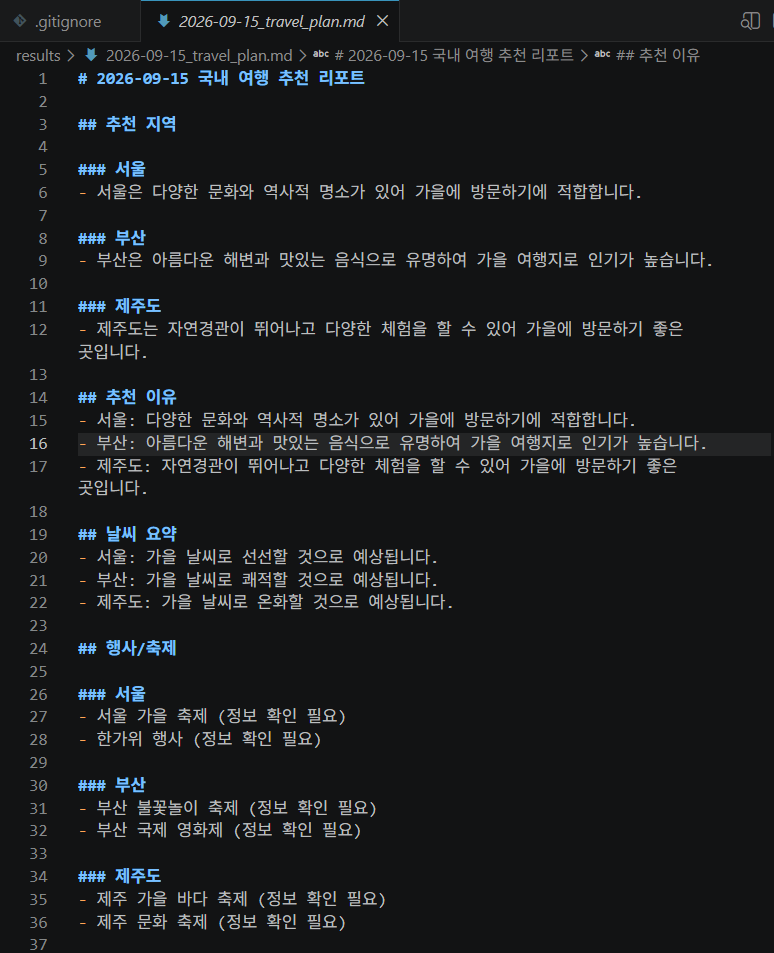
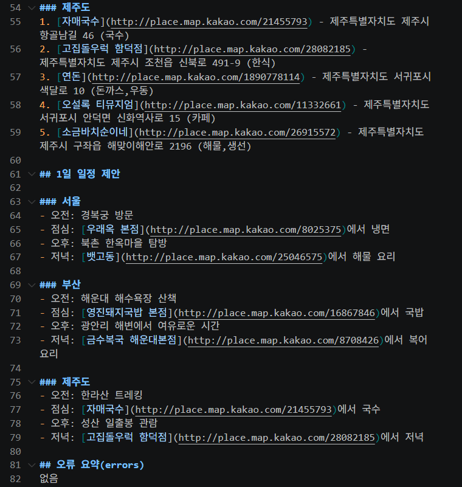
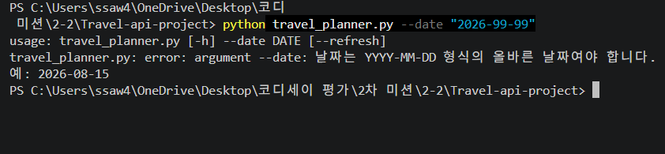
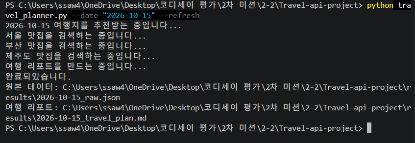
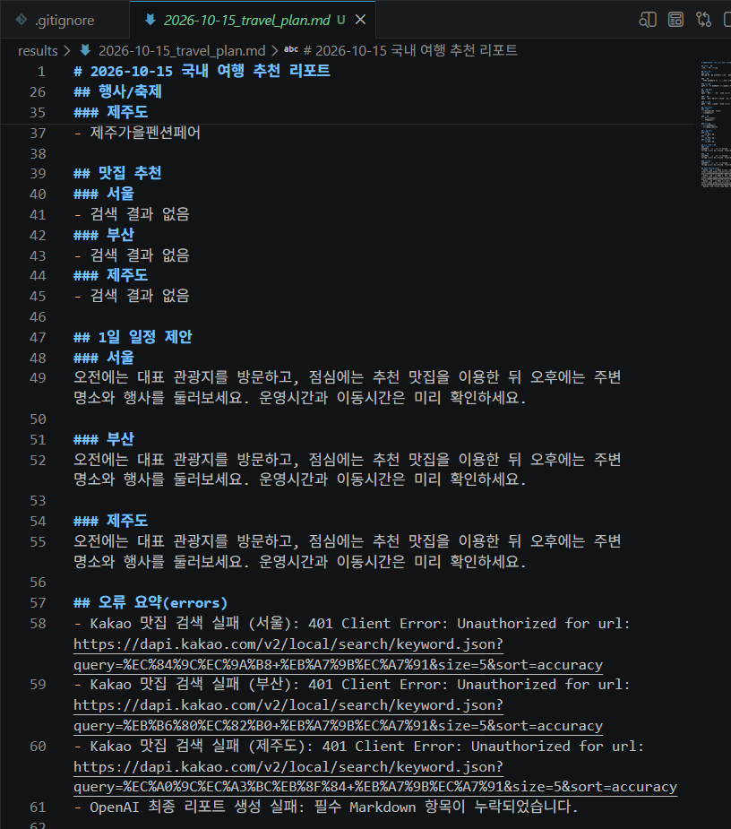

# 국내 여행 추천 CLI

## 프로그램 소개

날짜를 입력하면 OpenAI가 국내 여행지역 2~3곳을 추천하고 Kakao Local API가 각 지역의 맛집 5곳을 검색합니다. 두 결과로 지역별 Markdown 여행 리포트를 만듭니다. 날씨와 행사는 AI가 만든 참고용 정보이므로 출발 전에 공식 출처에서 최신 정보를 확인하세요. Python 3.10 이상이 필요합니다.

## 설치방법

프로젝트 폴더에서 가상환경을 만들고 패키지를 설치합니다.

```powershell
python -m venv .venv
.venv\Scripts\Activate.ps1
python -m pip install -r requirements.txt
```

macOS/Linux에서는 활성화 명령으로 `source .venv/bin/activate`를 사용합니다.

## API 키 설정방법

1. `.env.example`을 복사하여 `.env` 파일을 만듭니다.
2. 아래 예시 값을 본인의 실제 키로 바꿉니다.

```dotenv
OPENAI_API_KEY=실제_OpenAI_API_키
KAKAO_REST_API_KEY=실제_Kakao_REST_API_키
```

OpenAI API 플랫폼에서 OpenAI 키를, Kakao Developers 애플리케이션에서 **REST API 키**를 발급받습니다. 같은 이름의 운영체제 환경변수를 사용해도 됩니다.

## 실행방법

```bash
python travel_planner.py --date "2026-08-15"
```

`--date`는 필수이며 `YYYY-MM-DD` 형식의 실제 날짜여야 합니다. 예를 들어 `2026-08-15`처럼 입력합니다.

도움말 확인:

```bash
python travel_planner.py --help
```

도움말에는 `--date DATE`와 선택 옵션 `--refresh`가 표시됩니다.

같은 날짜로 다시 실행하면 저장된 결과를 사용하므로 API 비용과 시간을 절약합니다. API를 다시 호출해 결과를 갱신하려면 `--refresh`를 추가합니다.

```bash
python travel_planner.py --date "2026-08-15" --refresh
```

## 결과물 설명

실행하면 프로젝트 아래에 `results/` 폴더가 자동 생성됩니다. 모든 파일은 한글이 깨지지 않도록 UTF-8로 저장합니다.

- `YYYY-MM-DD_raw.json`: `recommendation`, 지역별 `restaurants`, `errors` 원본 데이터
- `YYYY-MM-DD_travel_plan.md`: 추천 지역, 날씨, 행사, 맛집, 하루 일정 리포트

Kakao 검색이 실패하거나 결과가 0건이어도 가능한 정보로 리포트를 만들며, 문제는 `errors`에서 확인할 수 있습니다.

원본 JSON의 주요 구조는 다음과 같습니다.

- `recommendation.recommended_cities`: 추천 도시 2~3개
- `recommendation.city_details`: 도시별 `weather`, `events`, `reason`
- `restaurants`: 도시명을 키로 사용하는 지역별 맛집 목록
- `errors`: 실행 중 발생한 오류 메시지 목록

LLM 응답을 JSON으로 강제하면 필드 구조가 일정해져 파싱이 안정적이고, 추천 도시를 Kakao 검색의 다음 입력으로 쉽게 전달할 수 있습니다. 또한 저장·검증·리포트 생성 같은 후처리가 단순해집니다.

## 프로그램 흐름과 함수 역할

프로그램은 **입력 → 추천 → 검색 → 리포트 → 저장** 순서로 실행됩니다.

- `parse_args`, `valid_date`: 명령행 날짜 입력과 형식 검사
- `request_recommendation`: OpenAI에 복수 지역 추천 JSON 요청
- `validate_recommendation`, `normalize_city_name`: 응답 구조 검사와 도시 표준명 보정
- `search_restaurants`: 설정된 지도 제공자 선택
- `search_kakao_restaurants`: Kakao Local 맛집 검색
- `create_markdown_report`: OpenAI를 통한 최종 리포트 생성
- `fallback_report`: 최종 LLM 실패 시 기본 리포트 생성
- `load_cached_results`, `save_results`: 캐시 조회와 UTF-8 결과 저장

## 외부 API 요청 방식

Kakao Local API는 장소 정보를 **조회**하므로 HTTP `GET`을 사용하며, 검색어와 개수는 쿼리 파라미터로 전달합니다. OpenAI SDK는 새로운 추천과 리포트 생성을 요청하므로 내부적으로 `POST` 요청을 사용합니다. 즉, GET은 기존 데이터 조회에, POST는 입력 데이터를 보내 새 결과를 생성하는 작업에 사용합니다.

맛집 검색은 `MAP_PROVIDER` 설정과 `RESTAURANT_PROVIDERS` 등록표를 통해 선택합니다. 현재 기본 제공자는 `kakao`입니다. 다른 지도 API를 추가하려면 `search_kakao_restaurants`와 같은 형태의 함수를 만들고 등록표에 이름과 함수를 추가하면 나머지 흐름을 변경하지 않아도 됩니다.

## 오류 처리와 문제 해결

- OpenAI JSON 파싱·검증 실패: 정확한 JSON만 반환하도록 프롬프트를 강화해 최대 한 번 다시 요청합니다.
- Kakao `401`: REST API 키 종류, `.env` 변수명, `Authorization: KakaoAK ...` 헤더를 확인합니다.
- Kakao `403`: Kakao Developers에서 해당 앱의 카카오맵·Local API 사용 설정이 ON인지 확인합니다.
- `429` 또는 쿼터 오류: OpenAI 크레딧과 Kakao 사용량 한도를 확인합니다.
- 연결 오류: 인터넷, 방화벽, 프록시와 API 서비스 상태를 확인합니다.
- Kakao 검색 실패: `restaurants`를 빈 리스트로 두고 계속 실행하며, 예를 들어 `Kakao 맛집 검색 실패 (부산): 403 ...`이 `errors`에 저장됩니다.
- 검색 결과 0건: 리포트에는 일관되게 `검색 결과 없음`이라고 표시합니다. 행사 정보가 없으면 `확인된 정보 없음`, 일반 정보가 없으면 `정보 없음`을 사용합니다.

## 보너스 기능

- `recommended_cities`에 2~3개 지역을 저장하고 반복문으로 지역별 맛집을 검색합니다.
- 맛집 결과는 `{ "부산": [...], "제주": [...] }`처럼 지역별로 구분합니다.
- 같은 날짜의 정상 결과가 있으면 OpenAI와 Kakao API를 호출하지 않고 기존 결과를 즉시 사용합니다.
- 캐시는 자동 만료되지 않습니다. 최신 결과가 필요하면 `--refresh`로 강제 갱신합니다.
- `서울특별시` → `서울`, `제주특별자치도` → `제주도`처럼 행정구역명을 검색용 표준명으로 보정하고 세부 지역이 붙은 입력도 대표 지역으로 정리합니다.

## API 키 보안 주의사항

- API 키를 Python 코드에 직접 적지 마세요.
- `.env`를 Git에 커밋하거나 다른 사람에게 보내지 마세요.
- 이 프로젝트의 `.gitignore`는 `.env`를 제외합니다.
- 키가 공개되면 즉시 폐기하고 새 키를 발급하세요.
- `.env.example`에는 예시 값만 유지하세요.
- 커밋 전 `git status`에서 `.env`, `results/`, `__pycache__/`가 보이지 않는지 확인하세요.

서버나 CI에서는 `.env` 파일 대신 실행 환경의 비밀 변수 저장소에 키를 등록합니다. PowerShell에서 현재 세션에만 설정하는 예시는 다음과 같습니다.

```powershell
$env:OPENAI_API_KEY="실제_키"
$env:KAKAO_REST_API_KEY="실제_키"
python travel_planner.py --date "2026-08-15"
```

---

## 실행 결과 및 증빙자료

### 1. 프로젝트 구성



### 2. 프로그램 정상 실행 및 API 연동

`--date`로 날짜를 입력하면 추천, 지역별 맛집 검색, 리포트 저장을 차례로 수행합니다.



### 3. LLM 여행지 추천 결과(JSON)

복수 지역과 지역별 `weather`, `events`, `reason`을 구조화한 결과입니다.



### 4. Kakao Local API 맛집 검색 결과(JSON)

각 맛집의 `name`, `address`, `category`, `url`, `x`, `y`를 확인할 수 있습니다.



### 5. 최종 Markdown 여행 리포트





### 6. 잘못된 날짜 입력 예외처리

존재하지 않는 날짜를 입력하면 형식 안내 후 종료합니다.



### 7. Kakao Local API 실패 예외처리

Kakao 인증 실패 시에도 전체 프로그램은 중단되지 않고 결과와 오류 기록을 저장합니다.





> 위 오류 화면은 예외처리 테스트이며 정상 실행에서는 관련 오류가 없습니다.
